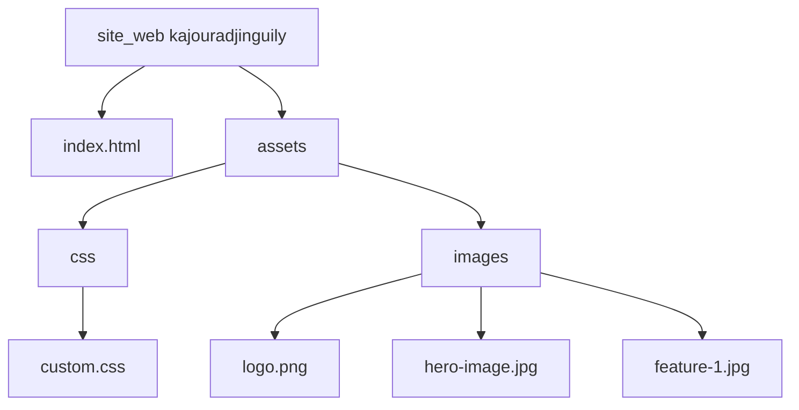

# Architecture Front-End pour Landing Page

## Vue d'ensemble
Cette architecture propose une landing page simple pour promouvoir un produit, utilisant uniquement HTML, Bootstrap et Tailwind CSS. La page sera responsive, moderne et optimisée pour la conversion.

## Technologies
- **HTML5** : Structure sémantique
- **Bootstrap 5** : Composants UI (navbar, buttons, grid)
- **Tailwind CSS** : Utilitaires pour styling rapide et responsive

## Structure des fichiers
```
site_web kajouradjinguily/
├── index.html                 # Page principale
├── assets/
│   ├── css/
│   │   └── custom.css         # Styles personnalisés (optionnel)
│   └── images/
│       ├── logo.png           # Logo du produit
│       ├── hero-image.jpg     # Image principale
│       └── feature-1.jpg      # Images pour sections
```

## Diagramme de structure


## Sections de la page
1. **Header** : Navigation avec logo et CTA (Call to Action)
2. **Hero Section** : Titre accrocheur, description, image, bouton principal
3. **Features Section** : Liste des avantages du produit avec icônes/cards
4. **Testimonials** : Avis clients (optionnel)
5. **Footer** : Liens de contact, réseaux sociaux

## Intégration des frameworks
- Bootstrap : Inclus via CDN dans `<head>`
- Tailwind : Inclus via CDN dans `<head>`
- Classes combinées : Utiliser Bootstrap pour composants structurés, Tailwind pour ajustements fins

## Responsive Design
- Utiliser les classes responsive de Bootstrap (col-md-*, etc.)
- Tailwind pour breakpoints personnalisés (sm:, md:, lg:)

## Performance
- Images optimisées
- CDN pour frameworks
- Pas de JavaScript personnalisé pour maintenir la simplicité